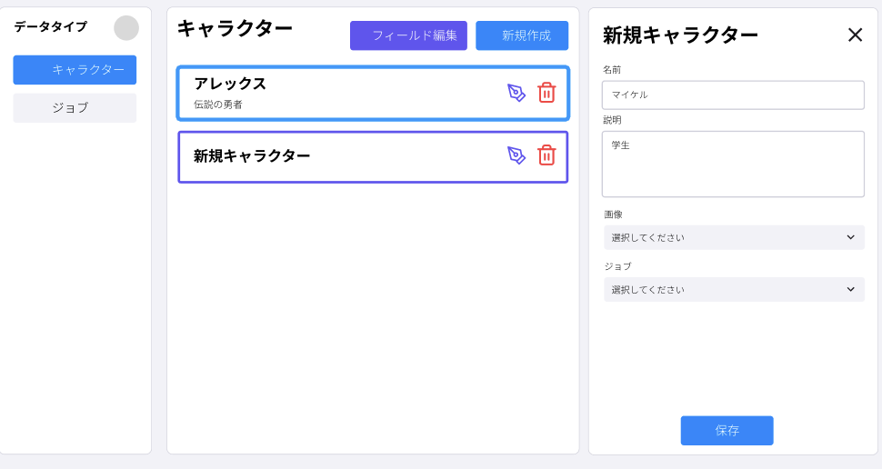

# RPG Box

直感的だけど自由に2D RPGが作れるブラウザサイトです。
プログラミングに関わりがない人でも直感的に、しかし本格的なRPGを作ることができます。



## なぜ作ったの？

自分が暇つぶしに使えたら面白そうだと思ったから。

---

## 機能紹介

### データ設定 — ✅ 実装済み

ゲームの基盤となるデータを設計する。

- カスタムデータ型の定義（キャラクター、モンスター、アイテム等、自由に）
- 18種類以上のフィールドタイプ（数値、文字列、画像、データ参照など）
- クラス定義・グローバル変数の管理
- 参照チェック付きの安全な削除

### マップ — 👷 実装中

ゲームに登場するマップの作成を行う。

RPGエディターの要領でチップやイベントを配置していく。

- WebGLベースのタイルペイント（ブラシ、塗りつぶし、消しゴム）
- オートタイル対応
- マルチレイヤーシステム
- プリファブ（再利用可能なオブジェクトテンプレート）の配置
- 8種類のオブジェクトコンポーネント（Transform, Sprite, Collider, Controller, Trigger等）
- Undo/Redo対応

### スクリプト — ✅ 実装済み

ゲームを動かすスクリプトを設計する。

元からあるスクリプトでRPGは作れます。安心してください。
しかし、スクリプトを自作することでオリジナルなゲームシステムを作れるようになる。

- Monaco Editor（VS Codeと同じエディタ）によるコード編集
- ゲームAPIのコード補完（IntelliSense）
- スクリプトテストパネルで即座に動作確認
- async/await対応の非同期スクリプティング

### UI — 👷 実装中

ゲーム内で表示する画面を設計する。

スクリプトからでもUI関連の処理はできるが、このページでは直感的にゲームのUIをデザインできる。

- WebGLキャンバスエディタでメニュー、HUD、メッセージボックス等を設計
- 9種類のUI要素（Frame, Text, Image, Shape等）
- タイムラインベースのアニメーションエディタ
- テンプレート化して再利用可能
- エディタとゲームで同じレンダラーを使うのでWYSIWYG

### ゲーム設定 — ✅ 実装済み

ゲームの名前や説明、ジャンルを設定できる。
また、自分で用意した画像や音声を取り込める。

- ゲーム情報（タイトル、説明、作者）の設定
- 開始マップの指定
- フォルダベースのアセット管理（画像・音声のアップロード）

### テストプレイ — ❌ 未実装

全体的なゲームをテストプレイできる。

- エディタ内でフルスクリーンのゲームプレビュー
- 現在の編集状態をそのままランタイムに渡してプレイ
- 一時停止・再開・終了のオーバーレイ操作

### エクスポート — ❌ 未実装

最終的なゲームファイルとして出力。WebGLとしてHTMLに埋め込める予定。

---

## ゲームエンジン — 👷 実装中

エディタとは別に、ゲームを実際に動かすランタイムエンジンを内蔵。

- 固定60fpsゲームループ
- キーボード入力管理
- グリッドベース移動（ピクセル補間によるスムーズ描画）
- カメラ追従 + マップ境界クランプ
- トリガーシステム（会話、接触、踏破、自動、入力）
- マップ遷移
- 13種類のイベントアクション
- Tweenアニメーション（20種類以上のイージング）
- UIキャンバスランタイム（エディタで作った画面をゲーム中に表示）

---

## 技術スタック

| レイヤー          | 技術                         |
| ----------------- | ---------------------------- |
| フレームワーク    | Next.js 14 (App Router)      |
| 言語              | TypeScript (strict mode)     |
| スタイリング      | Tailwind CSS v4              |
| UIコンポーネント  | shadcn/ui (Radix UI)         |
| 状態管理          | Zustand + Immer              |
| フォーム          | React Hook Form + Zod        |
| グラフィックス    | WebGL (twgl.js)              |
| コードエディタ    | Monaco Editor                |
| ドラッグ&ドロップ | dnd-kit                      |
| ストレージ        | IndexedDB                    |
| テスト            | Jest + React Testing Library |

## セットアップ

```bash
npm install
npm run dev
```

[http://localhost:3000](http://localhost:3000) を開く。

## ライセンス

本プロジェクトは現在、再配布用のライセンスを設定していません。
