# RPG Box UI フロー設計図

## 用語定義

本ドキュメントで使用する用語の定義:

### UI要素の用語

| 用語           | 定義                                       | 例                                         |
| -------------- | ------------------------------------------ | ------------------------------------------ |
| **モーダル**   | 操作をブロックするオーバーレイダイアログ   | 新規作成、削除確認、イベント編集           |
| **パネル**     | 画面の一部として常駐する領域               | プロパティパネル、左カラム、右カラム       |
| **キャンバス** | オブジェクトを配置・編集する中央の作業領域 | マップキャンバス、UIキャンバス             |
| **プレビュー** | 実際の見た目を確認するための表示領域       | タイムラインプレビュー、アセットプレビュー |
| **トースト**   | 一時的に表示される通知メッセージ           | エラー通知、保存完了通知                   |

### 機能の用語

| 用語               | 定義                               | 使い分け                                       |
| ------------------ | ---------------------------------- | ---------------------------------------------- |
| **イベント**       | トリガー + アクションの組み合わせ  | オブジェクトに設定する「何が起きたら何をする」 |
| **アクション**     | 実行される個々の処理               | メッセージ表示、変数操作、SE再生など           |
| **トリガー**       | アクションを発火させる条件         | トーク、タッチ、ステップ、常時など             |
| **ファンクション** | UI画面に定義する呼び出し可能な処理 | show(), hide(), set() など                     |

### データ構造の用語

| 用語       | 定義                               | 用途                                                |
| ---------- | ---------------------------------- | --------------------------------------------------- |
| **クラス** | 複数フィールドの再利用可能な構造体 | データタイプのフィールドテンプレート / 変数のタイプ |

### テストの種類

| 種類                     | 目的                           | 場所               |
| ------------------------ | ------------------------------ | ------------------ |
| **ファンクションテスト** | UI画面のファンクション動作確認 | UI設計ページ       |
| **スクリプトテスト**     | スクリプト単体の動作確認       | スクリプトページ   |
| **テストプレイ**         | ゲーム全体の動作確認           | テストプレイボタン |

---

## 1. 全体画面構成

### グローバルナビゲーション（ヘッダー）

```
┌─────────────────────────────────────────────────────────────────────────────┐
│ [≡] [◇ RPG Box] [データ▼] [マップ▼] [スクリプト▼] [UI▼] [ゲーム設定▼] [▶] │
└─────────────────────────────────────────────────────────────────────────────┘
```

- **ドロップダウン**: ホバー + クリック併用
- **アクティブ状態**: 下線またはハイライトで現在地を明示
- **[▶]**: テストプレイ開始

### ハンバーガーメニュー [≡]

```
┌─────────────────────────┐
│ プロジェクト            │
│   新規作成              │
│   開く                  │
│   保存           Ctrl+S │
│   名前を付けて保存      │
│   一時データをクリア    │
├─────────────────────────┤
│ エクスポート            │
│   Webゲーム出力         │
├─────────────────────────┤
│ 設定                    │
│   エディタ設定          │
│   ショートカット一覧  ? │
├─────────────────────────┤
│ ヘルプ                  │
│   ドキュメント          │
│   バージョン情報        │
├─────────────────────────┤
│ アカウント              │
│   ログイン / ログアウト │
│   プロフィール          │
└─────────────────────────┘
```

### ナビゲーションドロップダウン

| メニュー   | サブメニュー                                                            |
| ---------- | ----------------------------------------------------------------------- |
| データ     | データ設定 / クラス / 変数                                              |
| マップ     | マップ編集 / マップデータ / オブジェクトプレハブ / イベントテンプレート |
| スクリプト | イベントスクリプト / コンポーネントスクリプト                           |
| UI         | 画面設計 / オブジェクトUI設計 / タイムライン / シェーダー               |
| ゲーム設定 | ゲーム情報 / 画像アセット / 音声アセット / フォントアセット             |

### エディタレイアウト（3カラム基本）

```
┌─────────────────────────────────────────────────────────────────────────────┐
│ [≡] [◇ RPG Box] [データ▼] [マップ▼] [スクリプト▼] [UI▼] [ゲーム設定▼] [▶] │
├─────────────────────────────────────────────────────────────────────────────┤
│ データ設定  ← 現在のページ名                                                │
├───────────────┬─────────────────────────────────┬───────────────────────────┤
│ 左カラム      │        中央カラム                │ 右カラム                  │
│               │                                 │                           │
│ リスト/ツリー │        メインエリア              │ プロパティ/詳細           │
│               │       （キャンバス等）           │                           │
│               │                                 │                           │
└───────────────┴─────────────────────────────────┴───────────────────────────┘
```

### エディタ共通機能

#### Undo/Redo

| 項目             | 仕様                                               |
| ---------------- | -------------------------------------------------- |
| ショートカット   | Ctrl+Z（Undo）/ Ctrl+Y または Ctrl+Shift+Z（Redo） |
| 対象範囲         | 現在のページ内の操作のみ                           |
| 履歴件数         | 最大100件                                          |
| 保存時の挙動     | 履歴は維持（保存しても取り消し可能）               |
| ページ切り替え時 | 履歴はページごとに独立して保持                     |

**Undo可能な操作:**
| カテゴリ | 操作例 |
|---------|--------|
| データ編集 | フィールド値の変更、データ追加/削除、フィールド追加/削除 |
| マップ編集 | チップ配置、オブジェクト配置/移動/削除、プロパティ変更 |
| UI設計 | オブジェクト配置/移動/削除/リサイズ、プロパティ変更 |
| スクリプト | コード編集（Monaco Editor内蔵のUndo） |

**Undo不可能な操作:**

- ファイルのアップロード/削除（アセット管理）
- プロジェクト保存/読み込み
- エクスポート

#### ショートカットキー一覧

**全ページ共通:**
| キー | 動作 |
|------|------|
| Ctrl+Z | Undo |
| Ctrl+Y / Ctrl+Shift+Z | Redo |
| Ctrl+S | 手動保存 |
| Ctrl+F | ページ内検索 |
| Ctrl+P | 参照検索（選択中の項目がどこで使われているか） |
| ? | ショートカット一覧を表示 |
| Delete | 選択項目を削除（確認ダイアログ付き） |
| Ctrl+C / Ctrl+V / Ctrl+X | コピー / ペースト / カット |

**マップ編集:**
| キー | 動作 |
|------|------|
| B | ペンツール |
| E | 消しゴム |
| G | 塗りつぶし |
| 1-9 | レイヤー切り替え |
| Space + ドラッグ | キャンバス移動 |

**UI設計:**
| キー | 動作 |
|------|------|
| Ctrl+A | 全選択 |
| Shift+クリック | 複数選択に追加 |
| 矢印キー | 選択オブジェクトを1px移動 |
| Shift+矢印キー | 選択オブジェクトを10px移動 |

**テストプレイ:**
| キー | 動作 |
|------|------|
| F12 | デバッグコンソール開閉 |
| Esc | テスト停止 |

#### バリデーション・エラーハンドリング

**ID入力時のバリデーション（リアルタイム）:**

```
ID入力フィールド
┌─────────────────────────────────┐
│ [enemy_slime              ]    │ ← 入力中
│ ⚠️ このIDは既に使用されています │ ← エラーメッセージ（赤字）
└─────────────────────────────────┘
※ 作成ボタンは無効化される
```

| チェック項目 | エラーメッセージ                           |
| ------------ | ------------------------------------------ |
| 空欄         | IDは必須です                               |
| 重複         | このIDは既に使用されています               |
| 不正文字     | IDは英数字とアンダースコアのみ使用できます |
| 先頭が数字   | IDは数字で始めることはできません           |

**フィールドバリデーション:**

| タイプ         | チェック内容       | エラー表示                       |
| -------------- | ------------------ | -------------------------------- |
| 必須フィールド | 空欄チェック       | フィールド下に赤字メッセージ     |
| 数値           | 数値形式チェック   | 入力欄の枠を赤くハイライト       |
| データ選択     | 参照先存在チェック | 「未設定」または「削除済み」表示 |

**アセットアップロードエラー:**

| エラー種別             | 対応                                                     |
| ---------------------- | -------------------------------------------------------- |
| サイズ超過（10MB以上） | トースト通知「ファイルサイズが大きすぎます（最大10MB）」 |
| 非対応形式             | トースト通知「この形式には対応していません」             |
| 読み込み失敗           | トースト通知「ファイルの読み込みに失敗しました」         |

**トースト通知の表示位置:**

```
┌─────────────────────────────────────────────────────────────────────────────┐
│ [≡] [◇ RPG Box] [データ▼] ...                                              │
├─────────────────────────────────────────────────────────────────────────────┤
│                                                                             │
│                                        ┌──────────────────────────┐        │
│                                        │ ❌ ファイルサイズが      │        │
│                                        │    大きすぎます（最大10MB）│        │
│                                        │                    [×]   │        │
│                                        └──────────────────────────┘        │
│                                         ↑ 右上にトースト表示（3秒で自動消去）│
└─────────────────────────────────────────────────────────────────────────────┘
```

### キャンバス共通操作

全ページのキャンバスで共通の操作：

| 操作                  | 機能                   |
| --------------------- | ---------------------- |
| Space + ドラッグ      | キャンバス移動（パン） |
| 中クリック + ドラッグ | キャンバス移動（パン） |
| マウスホイール        | ズーム                 |

### マルチセレクト（複数選択）

マップ編集・UI設計で複数オブジェクトを選択した場合の挙動:

**選択方法:**
| 操作 | 挙動 |
|------|------|
| Shift + クリック | 選択に追加/除外（トグル） |
| Ctrl + クリック | 選択に追加/除外（トグル）※Shiftと同じ |
| 矩形ドラッグ | 範囲内のオブジェクトを全選択 |
| Ctrl + A | 現在のレイヤー/画面の全オブジェクト選択 |

**プロパティパネルの挙動:**

```
複数選択時のプロパティパネル
┌─────────────────────────┐
│ 3件選択中               │
├─────────────────────────┤
│ ▼ Transform             │
│   X: [― 複数 ―]        │ ← 値が異なる場合
│   Y: [100      ]        │ ← 値が同じ場合は表示
│   幅: [32      ]        │
│   高さ: [― 複数 ―]      │
├─────────────────────────┤
│ ▼ Sprite                │
│   ※ 共通コンポーネントのみ表示
└─────────────────────────┘
```

**複数選択時の編集:**
| 操作 | 挙動 |
|------|------|
| 値の入力 | 全選択オブジェクトに同じ値を適用 |
| ドラッグ移動 | 全選択オブジェクトを同時に移動（相対位置維持） |
| Delete | 全選択オブジェクトを一括削除（確認ダイアログあり） |
| Ctrl+C | 全選択オブジェクトをコピー |
| Ctrl+V | コピーしたオブジェクト群をペースト（相対位置維持） |

**ドラッグ中のビジュアルフィードバック:**

- 移動中: 半透明のゴースト表示 + 元位置に点線枠
- ドロップ不可エリア: カーソルが禁止マークに変化、ゴーストが赤枠に

### ページ構成図

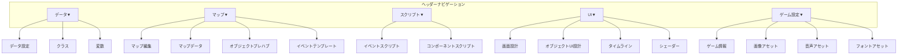

---

## 2. フロー#1: エディタ起動〜ページ遷移

### 起動フロー

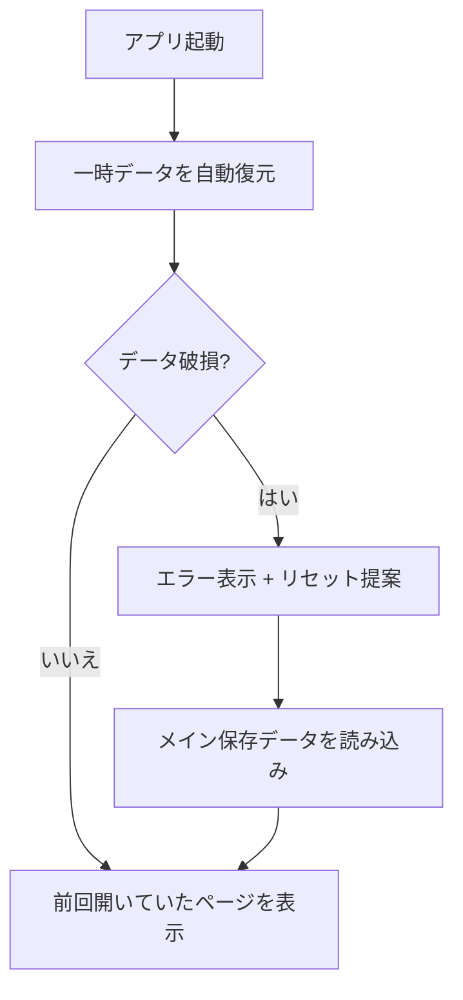

- 常に自動復元（確認ダイアログなし）
- データ破損時のみエラー表示
- 手動リセット: ハンバーガーメニュー → 「一時データをクリア」

### ページ遷移フロー

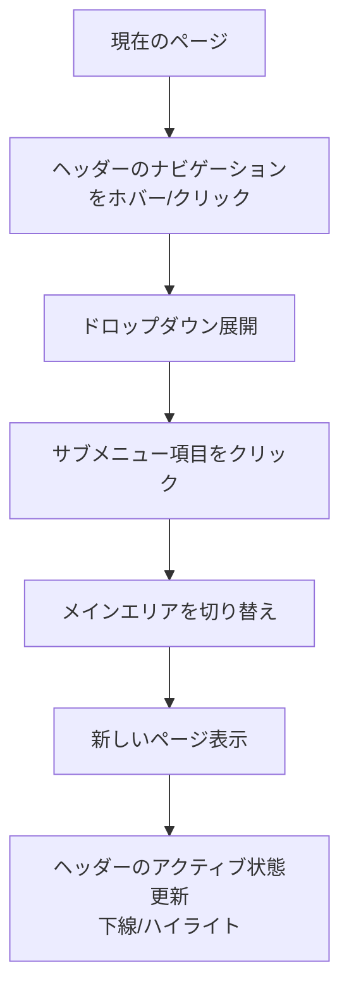

### 保存フロー

#### 保存領域の構成

| 領域           | 用途                           | 保存タイミング                  | 技術         |
| -------------- | ------------------------------ | ------------------------------- | ------------ |
| **一時領域**   | 作業中データの自動バックアップ | 編集操作ごと（デバウンス500ms） | LocalStorage |
| **メイン領域** | 正式な保存データ               | Ctrl+S / 保存ボタン押下時       | IndexedDB    |
| **クラウド**   | Phase 2でのオンライン同期      | メイン保存後（ログイン時のみ）  | Supabase     |

#### 自動保存と手動保存の関係

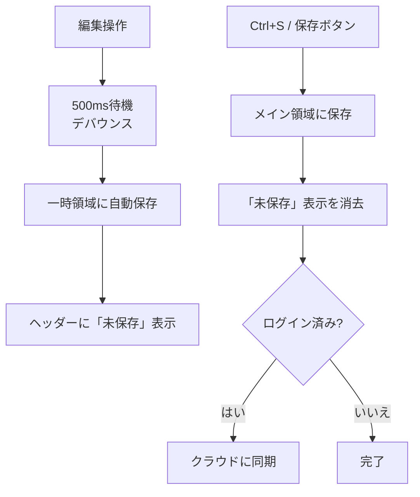

**「未保存」状態の表示:**

```
┌─────────────────────────────────────────────────────────────────────────────┐
│ [≡] [◇ RPG Box] [データ▼] ... [ゲーム設定▼] [● 未保存] [▶]              │
└─────────────────────────────────────────────────────────────────────────────┘
                                               ↑ 編集後、手動保存前に表示
```

#### 起動時の復元ロジック

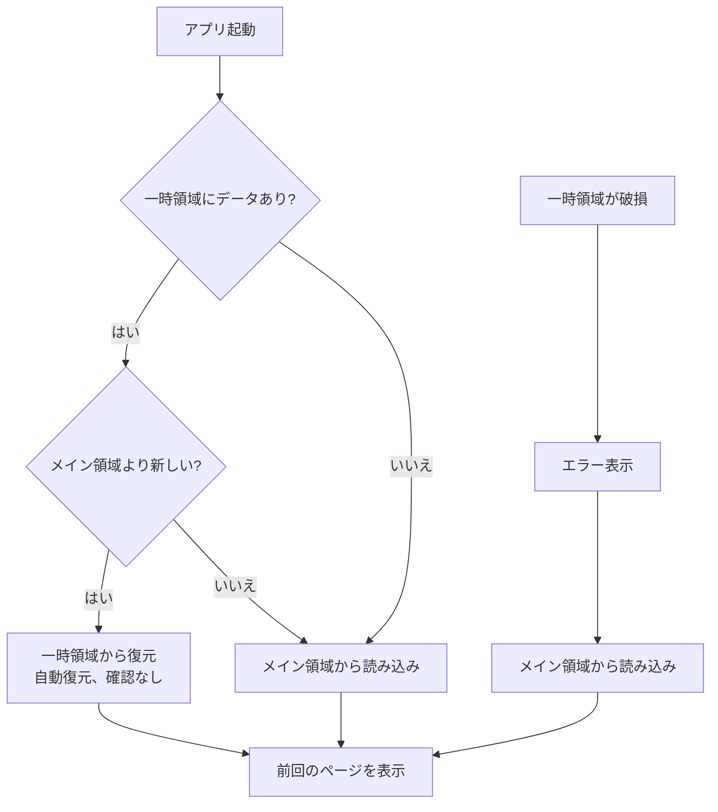

**ユーザーへの注意点:**

- 自動保存だけでは「正式に保存」されない（一時領域のみ）
- ブラウザのストレージクリアで一時領域は消える
- 重要な作業後は必ず Ctrl+S で手動保存を推奨

---

## 3. フロー#2: データ管理

### データタイプ作成フロー

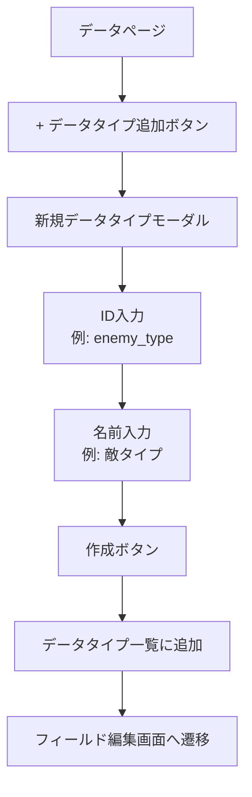

### フィールド追加フロー

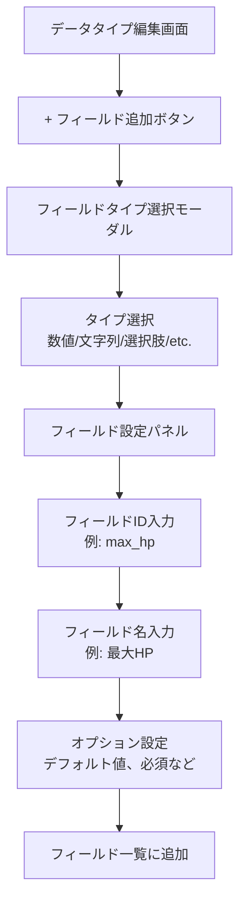

### データ追加フロー

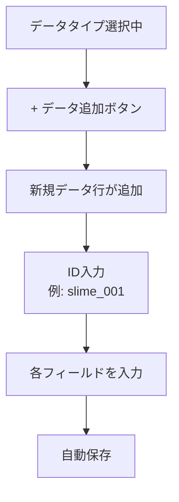

### データ画面レイアウト

```
┌─────────────────────────────────────────────────────────────┐
│ データ設定  ← 現在のページ名（左上に表示）                   │
├──────────┬───────────────┬──────────────────────────────────┤
│データタイプ│  データ一覧    │      フォームビルダー             │
│  + 追加   │ [検索...]     │                                  │
│          │               │  ┌────────────────────────────┐ │
│▶キャラクター│ ├ レックス    │  │ 名前            [文字列]  │ │
│ ジョブ    │ ├ イアン      │  │ ┌────────────────────┐    │ │
│ アイテム  │ └ アリス ◀    │  │ │ アリス            │    │ │
│          │               │  │ └────────────────────┘    │ │
│          │ [+ 新規追加]   │  └────────────────────────────┘ │
└──────────┴───────────────┴──────────────────────────────────┘
```

### 削除時の参照整合性チェック

データ・クラス・プレハブなどが他から参照されている場合の削除フロー:

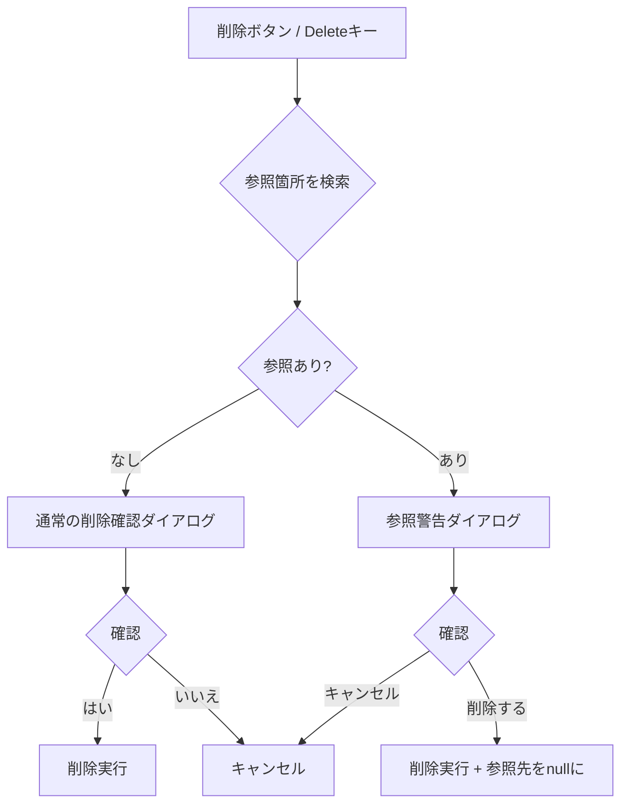

**参照警告ダイアログ（小モーダル）:**

```
┌─────────────────────────────────────────┐
│  ⚠️ 参照されています                    │
│                                         │
│  「スライム」は以下で使用されています:  │
│                                         │
│  ・敵グループ「森の遭遇」の敵編成      │
│  ・敵グループ「洞窟の敵」の敵編成      │
│  ・マップ「始まりの森」のオブジェクト  │
│                                         │
│  削除すると、これらの参照は            │
│  「未設定」になります。                │
│                                         │
│      [キャンセル]  [削除する]          │
└─────────────────────────────────────────┘
```

**参照チェック対象:**
| 削除対象 | チェックする参照元 |
|---------|-------------------|
| データ | 他データの「データ選択」「データリスト」「データテーブル」フィールド |
| データタイプ | フィールドの「データ選択」で参照しているデータタイプ |
| クラス | データタイプのフィールド構成 / 変数のタイプ定義 |
| プレハブ | マップ上の配置済みオブジェクト |
| イベントテンプレート | オブジェクトのイベント内アクション |
| 画面（UI） | スクリプトからの参照（静的解析は困難、警告のみ） |

---

## 3.1 変数 ページ

ゲーム内で使用するグローバル変数を管理

### 変数仕様

- **スコープ**: グローバルのみ（ゲーム全体で共有）
- **タイプ**: 数値、文字列、ブーリアン、クラス（クラスページで定義）
- **配列**: 全タイプで配列として定義可能
- **初期値**: GUI入力（配列は要素追加ボタン、クラスは各フィールド入力）

### 変数作成フロー

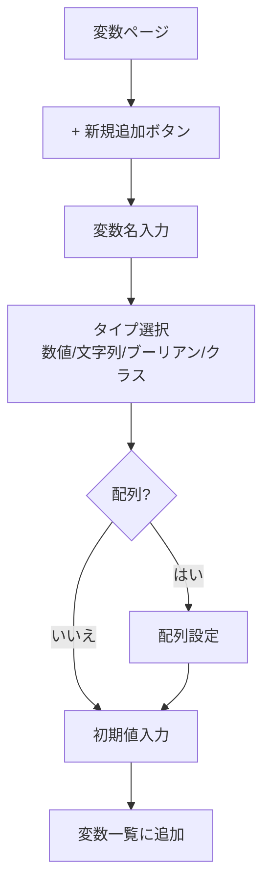

### 変数画面レイアウト

```
┌──────────────────┬────────────────────────────────────────────────┐
│ 変数一覧          │  変数編集                                      │
│ [+ 新規追加]      │                                                │
│                  │  変数名: [gold                    ]            │
│ ▶gold            │                                                │
│   partySize      │  タイプ: [数値 ▼]                              │
│   flags          │                                                │
│   inventory      │  配列:   [ ] ← チェックボックス                 │
│   partyMembers   │                                                │
│                  │  初期値: [0                       ]            │
│                  │                                                │
│                  ├────────────────────────────────────────────────┤
│                  │  （配列ONの場合）                               │
│                  │  初期値:                                       │
│                  │  ┌──────────────────────────────────────────┐ │
│                  │  │ [0] [100        ] [×]                    │ │
│                  │  │ [1] [200        ] [×]                    │ │
│                  │  │ [+ 要素追加]                              │ │
│                  │  └──────────────────────────────────────────┘ │
│                  │                                                │
│                  ├────────────────────────────────────────────────┤
│                  │  （クラス型の場合）                             │
│                  │  タイプ: [クラス ▼] [キャラ情報 ▼]             │
│                  │  初期値:                                       │
│                  │  ┌──────────────────────────────────────────┐ │
│                  │  │ name:  [                  ]              │ │
│                  │  │ level: [1                 ]              │ │
│                  │  │ hp:    [100               ]              │ │
│                  │  └──────────────────────────────────────────┘ │
└──────────────────┴────────────────────────────────────────────────┘
```

---

## 3.2 クラス ページ

フィールドのテンプレートおよび変数のカスタム型として使用するクラス（構造体）を定義

### クラス仕様

- **フィールドタイプ**: 全フィールドタイプが使用可能
- **フィールド配列**: 不可（単一値のみ）。配列が必要な場合は変数側で定義
- **テンプレート用途**: データタイプのフィールド構成にクラスを参照として組み込み可能（変更が全体に反映）
- **変数型用途**: 変数のタイプとして使用

### クラス作成フロー

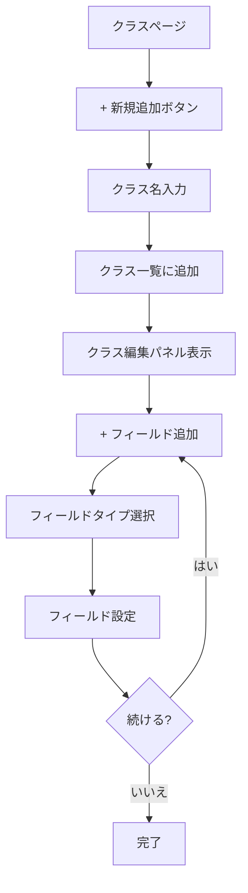

### クラス画面レイアウト

```
┌──────────────────┬────────────────────────────────────────────────┐
│ クラス一覧        │  クラス編集                                    │
│ [+ 新規追加]      │                                                │
│                  │  クラス名: [ステータス              ]           │
│ ▶ステータス       │                                                │
│   座標           │  フィールド一覧                                │
│   アイテム情報    │  ┌────────────────────────────────────────┐   │
│                  │  │ ≡ name     文字列   [編集] [×]         │   │
│                  │  │ ≡ hp       数値     [編集] [×]         │   │
│                  │  │ ≡ mp       数値     [編集] [×]         │   │
│                  │  │ ≡ level    数値     [編集] [×]         │   │
│                  │  └────────────────────────────────────────┘   │
│                  │    ↑ ドラッグで並び替え                        │
│                  │                                                │
│                  │  [+ フィールド追加]                             │
│                  │                                                │
│                  │  使用箇所:                                      │
│                  │  データタイプ: キャラクター, 敵, NPC            │
│                  │  変数: partyMembers, currentTarget             │
└──────────────────┴────────────────────────────────────────────────┘
```

---

## 4. フロー#3: マップ編集

### マップ関連ページの役割分担

マップ機能は4つのページで構成されています:

| ページ                   | 役割                       | 主な作業                                        |
| ------------------------ | -------------------------- | ----------------------------------------------- |
| **マップ編集**           | マップを描く（メイン作業） | チップ配置、オブジェクト配置、イベント設定      |
| **マップデータ**         | マップの設定を管理         | マップ一覧、レイヤー定義、チップセット設定、BGM |
| **オブジェクトプレハブ** | 再利用可能オブジェクト     | プレハブ作成・編集                              |
| **イベントテンプレート** | 再利用可能イベント         | テンプレート作成・編集                          |

**典型的なワークフロー:**

```
1. マップデータページでマップを新規作成（名前、サイズ、レイヤー構成）
   ↓
2. マップデータページでチップセットを設定（通行判定、足音）
   ↓
3. マップ編集ページでチップを配置
   ↓
4. マップ編集ページでオブジェクトを配置しイベントを設定
```

### マップ作成フロー

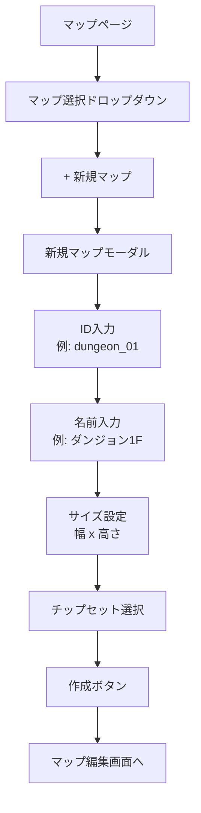

### チップ配置フロー

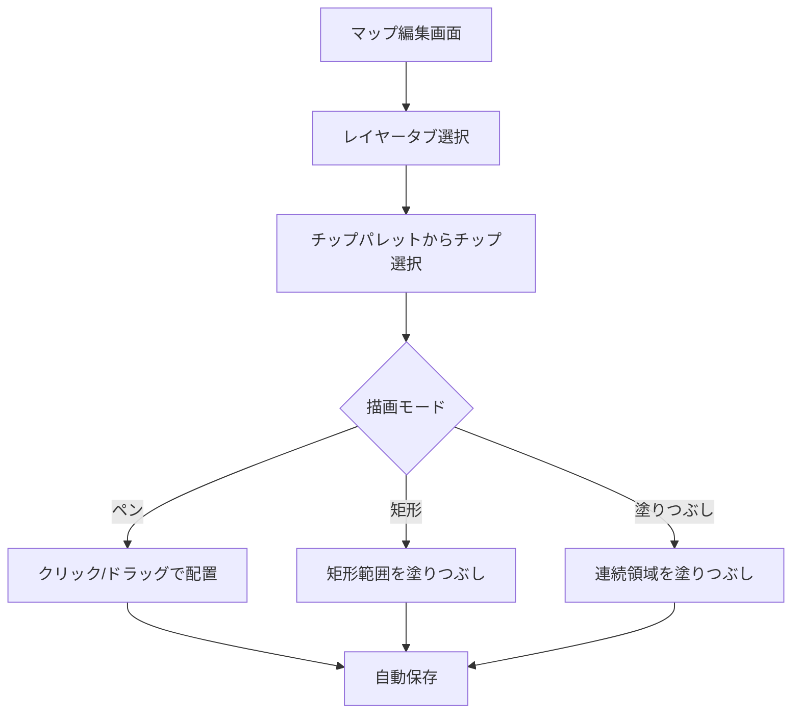

### オブジェクト配置フロー

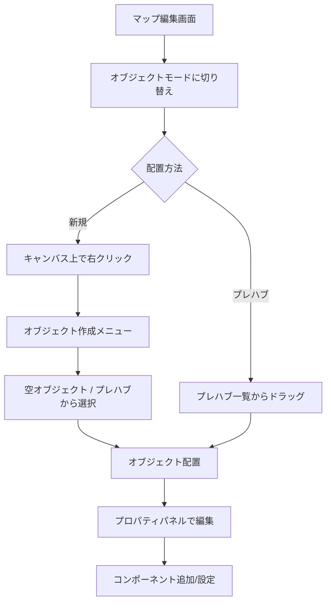

### イベント編集フロー

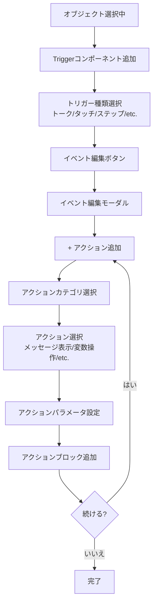

### レイヤー仕様

- **レイヤー種類**: タイルレイヤー（カスタム可能）+ オブジェクトレイヤー（1つ固定）
- **描画順**: タイルレイヤー → オブジェクトレイヤー → 最後のタイルレイヤー（屋根など）
- **レイヤー切り替え**: 左カラムのチップパレット上部にタブ表示、1-9キーでも切り替え可能

### ツールバー

**共通ツール（チップ・オブジェクト両モード）**
| アイコン | 名前 | ショートカット | 機能 |
|---------|------|---------------|------|
| ✋ | 掴む | | 選択・移動 |
| 🖌 | ペン | B | チップ/オブジェクト配置 |
| 🧹 | 消しゴム | E | 削除 |
| 🪣 | 塗りつぶし | G | 連続領域を塗りつぶし |
| 📋 | 矩形選択 | | 範囲選択 |
| ✂ | 範囲削除 | | 選択範囲を削除 |

**オブジェクトモード専用**
| アイコン | 名前 | 機能 |
|---------|------|------|
| ✏️ | 編集 | ダブルクリックで編集モーダル |

### マップ編集画面レイアウト

```
┌───────────────────┬─────────────────────────────────────┬───────────────────┐
│ [マップ ▼]        │                                     │ プロパティ        │
│ ・マップ一覧       │  ┌───┬─────────────────────────┐  │                   │
│ ・チップセットA    │  │✋│                         │  │ [選択なし時]      │
│ ・チップセットB    │  │🖌│       キャンバス          │  │ マップ設定        │
│ ・オブジェクト     │  │🧹│                         │  │                   │
│                   │  │🪣│                         │  │ [オブジェクト選択時]│
│ （選択に応じて     │  │📋│                         │  │ コンポーネント    │
│  下部の内容が変わる）│  │✂│                         │  │ ・Transform       │
├───────────────────┤  │✏️│← オブジェクトモード時   │  │ ・Sprite          │
│ [チップセット選択時]│  └───┴─────────────────────────┘  │ [+ コンポーネント]│
│ [地面][装飾][屋根] │    ↑ 透明ツールバー               │                   │
│ ┌──┬──┬──┬──┐    │                                     │                   │
│ │  │  │  │  │    │                                     │                   │
│ └──┴──┴──┴──┘    │                                     │                   │
├───────────────────┤                                     │                   │
│ [オブジェクト選択時]│                                     │                   │
│ ・プレハブ一覧     │                                     │                   │
│ ・配置済み一覧     │                                     │                   │
└───────────────────┴─────────────────────────────────────┴───────────────────┘
```

**左カラム ドロップダウン内容:**
| 項目 | 選択時の下部表示 |
|------|-----------------|
| マップ一覧 | マップ選択 + 新規作成 |
| チップセットA/B/... | レイヤータブ + チップパレット |
| オブジェクト | プレハブ / 配置済み一覧 |

---

## 4.1 マップデータ ページ

マップ一覧とチップセット定義の管理

### マップデータ画面レイアウト

```
┌─────────────────┬─────────────────────────┬─────────────────────────────────┐
│ マップリスト [+] │  始まりの町         📋  │  マップチップ [レイヤー1▼]   📋  │
│                 │                         │                                 │
│ [始まりの町]    │  名前                   │  ┌─┬─┬─┬─┬─┐   ┌──┐           │
│ [危険な森]      │  [始まりの町        ]   │  │○│×│○│ │ │   │▓▓│ 選択     │
│ [小西タウン]    │                         │  ├─┼─┼─┼─┼─┤   └──┘           │
│                 │  説明                   │  │ │ │ │ │ │                   │
│                 │  ┌───────────────────┐ │  ├─┼─┼─┼─┼─┤   判定           │
│                 │  │木の声さえも聞こえる│ │  │ │ │ │ │ │   [通行可能 ▼]   │
│                 │  │穏やかな町          │ │  └─┴─┴─┴─┴─┘                   │
│                 │  └───────────────────┘ │    ↑チップ       足音           │
│                 │                         │                 [草むら ▼]     │
│                 │  レイヤー               │                                 │
│                 │  名前         マップチップ│                                 │
│                 │  [レイヤー1] [選択... ▼]│                                 │
│                 │  [レイヤー2] [選択... ▼]│                                 │
│                 │  ⊕                      │                                 │
│                 │                         │                                 │
│                 │  BGM                    │                                 │
│                 │  [ゆるやかに行こう ▼]   │                                 │
└─────────────────┴─────────────────────────┴─────────────────────────────────┘
```

**構成:**

- 左: マップリスト（選択式）
- 中: 選択マップの設定（名前、説明、レイヤー定義、BGM）
- 右: チップセット編集（左にチップ一覧、右に選択チップのプロパティ）

**チップ設定項目:**
| 項目 | 説明 |
|------|------|
| 判定 | 通行可能 / 通行不可 |
| 足音 | 草むら / 石畳 / 木床 など |

---

## 4.2 オブジェクトプレハブ

よく使うオブジェクトのテンプレート

### プレハブ仕様

- **編集場所**: 専用ページ または マップ編集ページの右パネル
- **更新時の反映**: プレハブ変更時は配置済みオブジェクトに自動反映
- **個別カスタマイズ**: 配置後の変更部分は除外（オーバーライド）

### プレハブ新規作成フロー（専用ページから）

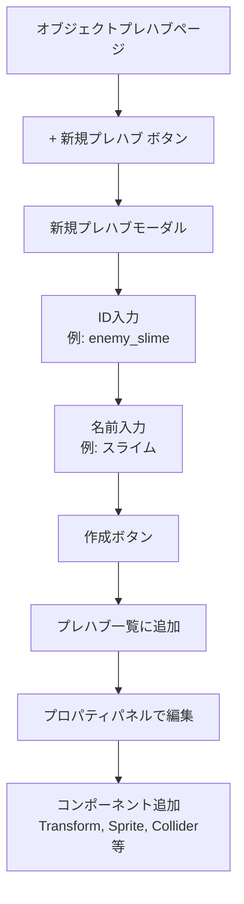

### マップからのプレハブ化フロー

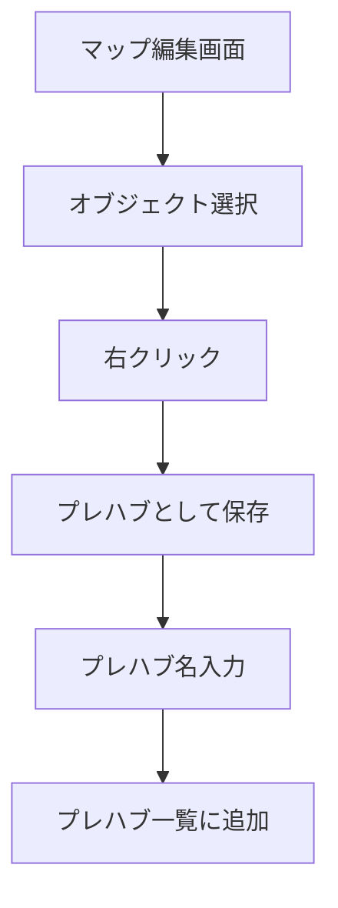

### プレハブ配置フロー

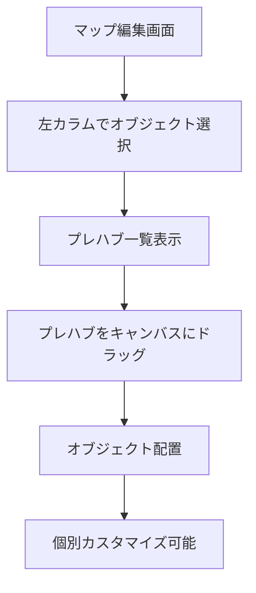

### プレハブ専用ページ画面レイアウト

```
┌───────────────────┬─────────────────────────────────────┬───────────────────┐
│ [プレハブ ▼]      │                                     │ プロパティ        │
│ ・プレハブ一覧     │                                     │                   │
│ ・+ 新規プレハブ   │                                     │ プレハブ名        │
│                   │       プレビューキャンバス           │ [enemy_slime   ]  │
│ [enemy_slime]     │                                     │                   │
│ [npc_villager]    │            ┌─────┐                 │ コンポーネント    │
│ [chest_normal]    │            │ 👾  │                 │ ▶ Transform       │
│                   │            └─────┘                 │ ▶ Sprite          │
│                   │                                     │ ▶ Collider        │
│                   │                                     │ ▶ Movement        │
│                   │                                     │                   │
│                   │                                     │ [+ コンポーネント]│
│                   │                                     │                   │
│                   │                                     │ 使用マップ:       │
│                   │                                     │ 始まりの町(3)     │
│                   │                                     │ 危険な森(5)       │
└───────────────────┴─────────────────────────────────────┴───────────────────┘
```

- 中央: プレビュー表示のみ（ツールバーなし）
- 右: プロパティ編集 + 使用マップ一覧

### マップ編集ページでのプレハブ/オブジェクト切り替え

```
右パネル上部
┌─────────────────────────────────┐
│ [プレハブ編集] [オブジェクト編集] │ ← 切り替えボタン
├─────────────────────────────────┤
│ プロパティ                       │
│ ...                             │
└─────────────────────────────────┘
```

- **プレハブ編集**: 変更が全配置先に反映
- **オブジェクト編集**: この配置のみ変更（オーバーライド）

---

## 4.3 イベントテンプレート

引数付きの再利用可能イベント

### イベントテンプレート作成フロー

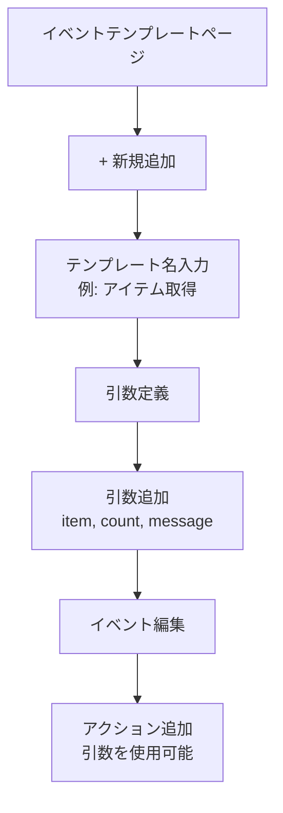

### イベントテンプレート使用フロー

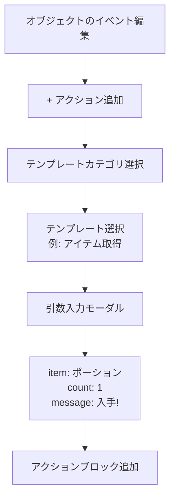

### イベントテンプレート画面レイアウト

```
┌───────────────────┬─────────────────────────────────────────────────────────┐
│ テンプレート一覧   │  アイテム取得                                           │
│ [+ 新規追加]      │                                                         │
│                   │  テンプレート名                                          │
│ [アイテム取得]    │  [アイテム取得                    ]                     │
│ [HP回復]          │                                                         │
│ [ワープ]          │  引数定義                                               │
│ [ショップ開始]    │  ┌─────────────────────────────────────────────────┐   │
│                   │  │ item   [データ参照▼] count  [数値▼]  [+ 追加]   │   │
│                   │  └─────────────────────────────────────────────────┘   │
│                   │                                                         │
│                   │  イベント編集                                           │
│                   │  ┌─────────────────────────────────────────────────┐   │
│                   │  │ 📦 メッセージ表示                                │   │
│                   │  │    「{item}を{count}個手に入れた」                  │   │
│                   │  ├─────────────────────────────────────────────────┤   │
│                   │  │ 📦 SE再生                                        │   │
│                   │  │    item_get                                      │   │
│                   │  ├─────────────────────────────────────────────────┤   │
│                   │  │ 📦 変数操作                                      │   │
│                   │  │    inventory += {item}                           │   │
│                   │  └─────────────────────────────────────────────────┘   │
│                   │  [+ アクション追加]                                     │
│                   │                                                         │
│                   │  使用箇所: 宝箱イベント(12), NPCイベント(3)              │
└───────────────────┴─────────────────────────────────────────────────────────┘
```

**構成:**

- 左: テンプレート一覧
- 右: テンプレート名 + 引数定義 + イベント編集（ブロック形式）+ 使用箇所

---

## 5. フロー#4: UI設計

### 画面作成フロー

```mermaid
flowchart TD
    A[UI設計ページ] --> B[画面選択ドロップダウン]
    B --> C[+ 新規画面]
    C --> D[新規画面モーダル]
    D --> E[ID入力<br>例: battle_menu]
    E --> F[名前入力<br>例: バトルメニュー]
    F --> G[作成ボタン]
    G --> H[画面編集へ]
```

### UIオブジェクト配置フロー

```mermaid
flowchart TD
    A[画面編集中] --> B{配置方法}
    B -->|新規| C[エレメント一覧から選択]
    C --> D[Image / Text / Shape / etc.]
    B -->|テンプレート| E[テンプレート一覧から選択]
    D --> F[キャンバスにドラッグ or クリック]
    E --> F
    F --> G[オブジェクト配置]
    G --> H[プロパティパネルで編集]
    H --> I[RectTransform設定<br>位置、サイズ、アンカー]
    I --> J[Visualコンポーネント設定<br>色、画像、テキスト]
```

### ファンクション編集フロー

```mermaid
flowchart TD
    A[画面編集中] --> B[ファンクション一覧パネル]
    B --> C{操作}
    C -->|新規| D[+ ファンクション追加]
    D --> E[ファンクション名入力<br>例: set]
    E --> F[引数定義<br>名前、型、デフォルト値]
    C -->|編集| G[ファンクション横の編集ボタン]
    F --> H[ブロック編集画面]
    G --> H
    H --> I[+ アクション追加]
    I --> J[アクション選択<br>オブジェクト操作/アニメーション/etc.]
    J --> K[パラメータ設定]
    K --> L{続ける?}
    L -->|はい| I
    L -->|いいえ| M[完了]
```

### ファンクションテストフロー

```mermaid
flowchart TD
    A[ファンクション編集中] --> B[▶ テストボタン]
    B --> C[右パネルにテストパネル展開]
    C --> D[引数入力<br>JSON形式]
    D --> E[実行ボタン]
    E --> F[キャンバスにリアルタイム反映]
    F --> G{結果確認}
    G -->|修正が必要| H[ファンクション編集]
    H --> B
    G -->|OK| I[クリアボタン]
    I --> J[初期状態に戻る]
```

### テンプレート保存フロー

```mermaid
flowchart TD
    A[UIオブジェクト選択中] --> B[右クリック]
    B --> C[テンプレートとして保存]
    C --> D[テンプレート名入力モーダル]
    D --> E[保存ボタン]
    E --> F[TemplateControllerコンポーネント自動追加]
    F --> G[テンプレート一覧に表示]
    G --> H[TemplateController編集]
    H --> I[引数定義]
    I --> J[onSpawnアクション編集]
```

### UI設計画面レイアウト

```
┌───────────────┬─────────────────────────────────┬───────────────────┐
│ [画面 ▼]      │           キャンバス             │ プロパティ /      │
│ ドロップダウン │    ゲーム画面範囲（赤枠）        │ ファンクション編集 │
│ ・画面一覧    │                                 │                   │
│ ・エレメント  │                                 │ （選択に応じて    │
│ ・テンプレート │                                 │  内容が切り替わる）│
│ ・ファンクション│                                 │                   │
│               │                                 │ [オブジェクト選択時]│
│ （選択に応じて │                                 │ → プロパティ表示  │
│  内容が変わる）│                                 │                   │
│               │                                 │ [ファンクション選択時]│
│               │                                 │ → ブロック編集    │
└───────────────┴─────────────────────────────────┴───────────────────┘
```

**左カラム ドロップダウン切り替え:**
| 選択 | 表示内容 |
|------|---------|
| 画面一覧 | 画面選択 + 新規作成 |
| エレメント | Image/Text/Shape等のUI要素 |
| テンプレート | 保存済みテンプレート一覧 |
| ファンクション | show/hide/set等 + 新規追加 |
| オブジェクトリスト | キャンバス上の全オブジェクトを階層表示 |

### オブジェクトリスト選択時の表示

```
┌───────────────┬─────────────────────────────────┬───────────────────┐
│ [オブジェクト▼]│           キャンバス             │ プロパティ        │
│               │                                 │                   │
│ ▼ menu_window │                                 │ 選択オブジェクト  │
│   ├ title_text│                                 │ の編集           │
│   ├ hp_bar    │                                 │                   │
│   └ buttons   │                                 │                   │
│     ├ btn_atk │                                 │                   │
│     └ btn_def │                                 │                   │
│               │                                 │                   │
│ ▶ status_panel│                                 │                   │
│ ▶ dialog_box  │                                 │                   │
└───────────────┴─────────────────────────────────┴───────────────────┘
```

**オブジェクトリストの機能:**

- ツリー形式で親子関係を表示
- D&Dで親子関係を変更
- ダブルクリックでオブジェクト名を編集
- 右クリックでコンテキストメニュー（削除、複製、テンプレート化等）
- クリックでキャンバス上のオブジェクトを選択

---

## 5.1 オブジェクトUI設計

マップオブジェクト上に表示するUI（HPバー、ダメージ数字、リアクション等）

### オブジェクトUI仕様

- **画面設計と同じ機能** - エレメント配置、ファンクション編集、テンプレート
- **再利用可能** - 同じオブジェクトUIを複数のオブジェクトで共有可能

### オブジェクトUI作成フロー

```mermaid
flowchart TD
    A[オブジェクトUI設計ページ] --> B[+ 新規UI]
    B --> C[UI名入力<br>例: enemy_hp_bar]
    C --> D[UI編集画面へ]
    D --> E[エレメント配置]
    E --> F[ファンクション編集]
```

### オブジェクトUI画面レイアウト

```
┌───────────────────┬─────────────────────────────────────┬───────────────────┐
│ [オブジェクトUI▼] │                                     │ プロパティ /      │
│ ・UI一覧          │       プレビューキャンバス           │ ファンクション編集 │
│ ・エレメント      │                                     │                   │
│ ・テンプレート    │    ┌─────────────────────────┐     │ [オブジェクト選択時]│
│ ・ファンクション  │    │                         │     │ → プロパティ表示  │
│                   │    │    🧍 ← プレビュー対象   │     │                   │
│ [enemy_hp_bar]   │    │    ┌───────┐            │     │ [ファンクション選択時]│
│ [damage_number]  │    │    │ HP ██ │            │     │ → ブロック編集    │
│ [reaction]       │    │    └───────┘            │     │                   │
│                   │    │                         │     │                   │
│                   │    └─────────────────────────┘     │                   │
│                   │                                     │                   │
│                   │  プレビュー対象: [enemy_slime ▼]    │                   │
│                   │  （プレハブ/画像から選択）           │                   │
└───────────────────┴─────────────────────────────────────┴───────────────────┘
```

**導線:**
| 導線 | プレビュー対象 |
|------|---------------|
| メニューから | プレハブ/画像から選択 |
| マップ編集から（ObjectCanvas編集ボタン） | そのマップオブジェクト |

---

## 5.2 タイムライン

アニメーションテンプレートを動画編集風UIで作成

### タイムライン作成フロー

```mermaid
flowchart TD
    A[タイムラインページ] --> B[+ 新規タイムライン]
    B --> C[タイムライン名入力]
    C --> D[編集画面へ]
    D --> E[プロパティトラック追加]
    E --> F[Tweenバー配置]
    F --> G[開始時間/長さをドラッグ調整]
    G --> H[プレビュー再生]
```

### タイムライン画面レイアウト

```
┌─────────────────────────────────────────────────────────────────────┐
│ ┌─────────────────────────────────────────────────────────────────┐│
│ │                    プレビュー画面                               ││
│ │                  [◀] [▶再生] [■停止] [🔁ループ]                 ││
│ └─────────────────────────────────────────────────────────────────┘│
├─────────────────────────────────────────────────────────────────────┤
│ 時間軸   0ms      200ms     400ms     600ms     800ms    1000ms   │
├──────────┬──────────────────────────────────────────────────────────┤
│ X座標    │ ████████████████████                                    │
├──────────┼──────────────────────────────────────────────────────────┤
│ 透明度   │      ████████████                                       │
└──────────┴──────────────────────────────────────────────────────────┘
```

**タイムラインテスト:**
| 項目 | 仕様 |
|------|------|
| 再生コントロール | 再生/一時停止/停止/ループ |
| シーク | タイムラインバーをドラッグで任意位置に移動 |

---

## 5.3 シェーダー

### MVP仕様

- **プリセットシェーダー**のみ使用可能（ぼかし、グロー、色調変更など）
- **適用場所**: UIオブジェクト/マップオブジェクト（Sprite）のプロパティ内で選択
- **シェーダーページ**: 将来対応（GLSLコードでカスタムシェーダー作成）

### プリセット一覧

**画像エフェクト系:**

- ぼかし
- モザイク
- 色調変更
- グレースケール
- セピア

**演出系:**

- グロー
- アウトライン
- シルエット
- 波紋
- 歪み

### 将来対応: カスタムシェーダーページ

```
シェーダー（将来対応）
┌───────────────────┬─────────────────────────────────────┬───────────────────┐
│ シェーダー一覧     │                                     │ GLSLコード        │
│                   │       プレビュー                     │                   │
│ ▼ プリセット      │                                     │ uniform float u_  │
│   ぼかし          │    ┌─────────────────────────┐     │ time;             │
│   グロー          │    │                         │     │ void main() {     │
│                   │    │      🖼  ← 適用後       │     │   ...             │
│ ▼ カスタム        │    │                         │     │ }                 │
│   my_shader       │    └─────────────────────────┘     │                   │
│   [+ 新規作成]    │                                     │ パラメータ定義    │
│                   │  プレビュー対象: [画像を選択 ▼]      │ [+ 追加]          │
└───────────────────┴─────────────────────────────────────┴───────────────────┘
```

---

## 6. フロー#5: スクリプト編集

### スクリプト作成フロー

```mermaid
flowchart TD
    A[スクリプトページ] --> B{スクリプトタイプ}
    B -->|イベント| C[+ イベント ボタン]
    B -->|コンポーネント| D[+ コンポーネント ボタン]
    C --> E[新規スクリプト作成]
    D --> E
    E --> F[ID入力<br>例: battle_start]
    F --> G[名前入力<br>例: バトル開始処理]
    G --> H[作成ボタン]
    H --> I[エディタ画面へ]
```

### スクリプト編集フロー

```mermaid
flowchart TD
    A[スクリプト選択] --> B[Monaco Editor表示]
    B --> C[コード編集]
    C --> D[自動補完<br>IntelliSense]
    D --> E[自動保存]
    E --> F{テスト?}
    F -->|はい| G[テストパネル展開]
    G --> H[引数設定]
    H --> I[▶ 実行]
    I --> J[結果表示 / コンソール出力]
    F -->|いいえ| K[編集継続]
```

### 内部スクリプト作成フロー

```mermaid
flowchart TD
    A[親スクリプト編集中] --> B[内部スクリプト一覧パネル]
    B --> C[+ 内部スクリプト追加]
    C --> D[名前入力<br>例: calculateDamage]
    D --> E[作成ボタン]
    E --> F[内部スクリプトエディタ]
    F --> G[コード編集]
    G --> H[親スクリプトから直接呼び出し可能<br>import不要]
```

### スクリプト編集画面レイアウト

```
┌───────────────┬───────────────────────────────────┬─────────────────┐
│ スクリプト一覧 │       コードエディター             │ 設定パネル      │
│ （階層表示）   │                                   │                 │
│               │                                   │ [引数/フィールド]│
│ ▼ battle_start│                                   │ [+ 追加]        │
│   ├ _damage   │                                   │ 1. bg           │
│   └ _effect   │                                   │    型: [画像▼]  │
│ ▶ shop_system │                                   │    ラベル: 背景 │
│               │                    ┌─────────────┐│                 │
│ [+ イベント]   │                    │テスト条件    ││ [テストパネル]  │
│ [+ コンポーネント]│                 │（タブで開閉）││                 │
└───────────────┴───────────────────────────────────┴─────────────────┘
```

- 内部スクリプトは親スクリプトの下に階層表示（\_プレフィックス）
- テスト条件パネルはコードエディター内にタブで開閉

---

## 7. フロー#6: テストプレイ

### テストプレイ開始フロー

```mermaid
flowchart TD
    A[エディタ画面] --> B[テストプレイ▶ボタン]
    B --> C[ゲームウィンドウ表示]
    C --> D[ゲーム実行開始]
    D --> E{エラー発生?}
    E -->|はい| F[エラーオーバーレイ表示]
    F --> G[スタックトレース表示]
    G --> H{操作}
    H -->|続行| I[キー入力で続行]
    I --> D
    H -->|停止| J[テスト終了]
    E -->|いいえ| K[ゲーム継続]
    K --> L{停止?}
    L -->|はい| J
    L -->|いいえ| D
```

### デバッグコンソールフロー

```mermaid
flowchart TD
    A[テストプレイ中] --> B[F12キー または 設定キー]
    B --> C[ゲーム内コンソール開閉]
    C --> D[ログ表示<br>log/warn/error/debug]
    D --> E[スクリプトからの出力確認]
```

### テストプレイ画面レイアウト

```
┌─────────────────────────────────────────────────────────────────────┐
│                    ゲーム画面（プレビュー）                          │
│                                                                     │
│                         ┌───────────────┐                          │
│                         │               │                          │
│                         │   ゲーム表示   │                          │
│                         │               │                          │
│                         └───────────────┘                          │
│                                                                     │
│ [▶ 開始] [■ 停止] [⏸ 一時停止] [🔄 リスタート]                    │
├───────────────────────────────────┬─────────────────────────────────┤
│ 開始設定                          │ 変数設定                        │
│ [パターンA ▼] [+ 新規] [編集]     │ [パターン1 ▼] [+ 新規] [編集]   │
│                                   │                                 │
│ 開始マップ: [始まりの町 ▼]        │ gold: [1000        ]            │
│ 開始座標:   X [5  ] Y [10 ]       │ partySize: [4      ]            │
│ 初期パーティ: [選択...]           │ flag_tutorial: [✓]              │
│                                   │                                 │
├───────────────────────────────────┴─────────────────────────────────┤
│ デバッグ表示                                                        │
│ [✓] オブジェクト変数  [ ] 当たり判定  [ ] FPS表示  [ ] グリッド    │
└─────────────────────────────────────────────────────────────────────┘
```

**機能:**
| 機能 | 説明 |
|------|------|
| 開始設定パターン | マップ、座標、初期パーティを複数パターン保存 |
| 変数設定パターン | 変数の初期値を複数パターン保存 |
| デバッグ表示 | オブジェクト変数、当たり判定、FPS、グリッド |

---

## 8. フロー#7: 保存/エクスポート

### 手動保存フロー

```mermaid
flowchart TD
    A[編集中] --> B[Ctrl+S または 保存ボタン]
    B --> C[メイン保存領域に保存]
    C --> D{ログイン済み?}
    D -->|はい| E[クラウドに同期]
    E --> F[同期完了通知]
    D -->|いいえ| G[ローカル保存完了通知]
```

### エクスポートフロー

```mermaid
flowchart TD
    A[エディタ画面] --> B[エクスポートボタン]
    B --> C[エクスポートモーダル]
    C --> D[出力設定<br>解像度、FPS等]
    D --> E[エクスポート開始]
    E --> F[ビルド処理<br>未使用アセット除外、難読化]
    F --> G[ZIPファイル生成]
    G --> H[ダウンロード]
```

### エクスポート設定モーダル（大モーダル）

```
┌───────────────────────────────────────────────────────────────┐
│  Webゲーム出力                                            [×]  │
├───────────────────────────────────────────────────────────────┤
│                                                               │
│  出力形式                                                     │
│  [● WebGL（HTML）] ← MVPではこれのみ                          │
│  [○ デスクトップアプリ]  ← 将来対応                            │
│                                                               │
│  ─── ゲーム設定 ───                                           │
│                                                               │
│  ゲーム名      [マイRPG                          ]            │
│  解像度        [640 ▼] × [480 ▼] px                          │
│  目標FPS       [60 ▼]                                        │
│  スケーリング  [● 整数倍のみ] [○ 可変]                        │
│                                                               │
│  ─── 最適化オプション ───                                     │
│                                                               │
│  [✓] 未使用アセットを除外                                     │
│  [✓] コード難読化                                             │
│  [ ] デバッグ情報を含める                                     │
│                                                               │
│  ─── 出力プレビュー ───                                       │
│                                                               │
│  推定ファイルサイズ: 約 12.5 MB                               │
│  含まれるアセット: 画像 45件, 音声 23件, スクリプト 18件       │
│                                                               │
├───────────────────────────────────────────────────────────────┤
│                               [キャンセル]  [エクスポート開始] │
└───────────────────────────────────────────────────────────────┘
```

**エクスポート中の進捗表示:**

```
┌───────────────────────────────────────────────────────────────┐
│  エクスポート中...                                             │
├───────────────────────────────────────────────────────────────┤
│                                                               │
│  [████████████████████░░░░░░░░░░░░░░░░░░░░] 45%               │
│                                                               │
│  処理中: アセットのパッケージング...                           │
│                                                               │
│                                      [キャンセル]              │
└───────────────────────────────────────────────────────────────┘
```

---

## 9. フロー#8: 検索

### ページ内検索フロー (Ctrl+F)

```mermaid
flowchart TD
    A[任意のページ] --> B[Ctrl+F]
    B --> C[検索モーダル表示]
    C --> D[検索キーワード入力]
    D --> E[リアルタイム検索結果表示]
    E --> F[結果をクリック]
    F --> G[該当項目にフォーカス/選択]
    G --> H[モーダル閉じる]
```

### 参照検索フロー (Ctrl+P)

```mermaid
flowchart TD
    A[項目を選択中] --> B[Ctrl+P]
    B --> C[参照検索モーダル表示]
    C --> D[選択項目の参照先一覧表示]
    D --> E[結果をクリック]
    E --> F[該当ページ/項目へ遷移]
```

---

## 10. フロー#9: ゲーム設定

### 10.1 ゲーム情報

ゲームの基本設定

#### ゲーム情報編集フロー

```mermaid
flowchart TD
    A[ゲーム設定メニュー] --> B[ゲーム情報ページ]
    B --> C[各項目を編集]
    C --> D[ゲーム名入力]
    D --> E[説明入力]
    E --> F[画面サイズ設定]
    F --> G[初期マップ選択]
    G --> H[アイコン設定]
    H --> I[自動保存]
```

#### ゲーム情報画面レイアウト

```
┌─────────────────────────────────────────────────────────────────────────────┐
│                                                                             │
│  ゲーム名                                                                   │
│  [マイRPG                                              ]                   │
│                                                                             │
│  説明                                                                       │
│  ┌─────────────────────────────────────────────────────────────────────┐   │
│  │ 勇者となって世界を救う王道RPG                                        │   │
│  │                                                                     │   │
│  └─────────────────────────────────────────────────────────────────────┘   │
│                                                                             │
│  ジャンル                                                                   │
│  [RPG ▼]                                                                   │
│                                                                             │
│  画面サイズ                                                                 │
│  幅 [640    ] × 高さ [480    ] px                                         │
│                                                                             │
│  初期マップ                                                                 │
│  [始まりの町 ▼]                                                            │
│                                                                             │
│  アイコン                                                                   │
│  ┌────┐                                                                    │
│  │ 🎮 │  [変更]                                                           │
│  └────┘                                                                    │
│                                                                             │
└─────────────────────────────────────────────────────────────────────────────┘
```

#### ゲーム情報項目

| 項目       | 説明                 |
| ---------- | -------------------- |
| ゲーム名   | タイトル             |
| 説明       | ゲームの説明文       |
| ジャンル   | RPG、アクションなど  |
| 画面サイズ | ゲーム画面の解像度   |
| 初期マップ | ゲーム開始時のマップ |
| アイコン   | ゲームのアイコン画像 |

---

### 10.2 画像アセット

画像ファイルの管理とカテゴリ設定

#### 画像アセット画面レイアウト

```
┌──────────────────┬──────────────────────────────┬─────────────────────────┐
│ フォルダツリー    │  ファイル一覧                 │ アセット設定            │
│ [+ 新規フォルダ]  │                              │                         │
│                  │  ┌────┐ ┌────┐ ┌────┐      │ hero.png                │
│ ▼ characters    │  │ 🖼 │ │ 🖼 │ │ 🖼 │      │                         │
│   ├ face        │  │hero│ │npc1│ │npc2│      │ カテゴリ                │
│   └ walk        │  └────┘ └────┘ └────┘      │ [歩行チップ ▼]          │
│ ▼ effects       │                              │                         │
│ ▼ ui            │  [アップロード]               │ ─── 歩行チップ設定 ───  │
│ ▼ map_chips     │                              │                         │
│                  │                              │ 方向数                  │
│                  │                              │ [4方向 ▼]               │
│                  │                              │                         │
│                  │                              │ パターン数              │
│                  │                              │ [3 ▼]                   │
│                  │                              │                         │
│                  │                              │ フレーム速度            │
│                  │                              │ [━━━●━━] 200ms         │
│                  │                              │                         │
│                  │                              │ ─── プレビュー ───      │
│                  │                              │ ┌──────────┐            │
│                  │                              │ │  🚶 →    │            │
│                  │                              │ └──────────┘            │
└──────────────────┴──────────────────────────────┴─────────────────────────┘
```

**画像カテゴリと設定項目:**
| カテゴリ | 設定項目 |
|----------|---------|
| 画像 | なし（一般画像） |
| エフェクト | フレーム数、速度、ループ |
| 歩行チップ | 方向数、パターン数、フレーム速度 |
| マップチップ | なし（チップ設定はマップデータで） |

---

### 10.3 音声アセット

BGM・SE・ボイスの管理

#### 音声アセット画面レイアウト

```
┌──────────────────┬──────────────────────────────┬─────────────────────────┐
│ フォルダツリー    │  ファイル一覧                 │ アセット設定            │
│ [+ 新規フォルダ]  │                              │                         │
│                  │  ┌────┐ ┌────┐ ┌────┐      │ battle_01.mp3           │
│ ▼ bgm           │  │ 🎵 │ │ 🎵 │ │ 🎵 │      │                         │
│   ├ field       │  │bat │ │tow │ │dun │      │ カテゴリ                │
│   └ battle      │  └────┘ └────┘ └────┘      │ [BGM ▼]                 │
│ ▼ se            │                              │                         │
│   ├ system      │  [アップロード]               │ ─── BGM設定 ───         │
│   └ effect      │                              │                         │
│ ▼ voice         │                              │ ループ開始位置          │
│                  │                              │ [━━━●━━━━━] 5.2s       │
│                  │                              │                         │
│                  │                              │ デフォルト音量          │
│                  │                              │ [━━━━━━●━━] 80%        │
│                  │                              │                         │
│                  │                              │ ─── プレビュー ───      │
│                  │                              │ [▶再生] [■停止]         │
│                  │                              │ 0:00 ━━●━━━━━ 2:34    │
└──────────────────┴──────────────────────────────┴─────────────────────────┘
```

**音声カテゴリと設定項目:**
| カテゴリ | 設定項目 |
|----------|---------|
| BGM | ループ開始位置、デフォルト音量 |
| SE | デフォルト音量 |
| ボイス | デフォルト音量 |

---

### 10.4 フォントアセット

ゲーム内で使用するフォントの管理

#### フォントアセット画面レイアウト

```
┌──────────────────┬──────────────────────────────┬─────────────────────────┐
│ フォント一覧      │  プレビュー                   │ フォント設定            │
│ [+ アップロード]  │                              │                         │
│                  │  あいうえおABCDE12345        │ pixel_font.ttf          │
│ ▶ pixel_font    │                              │                         │
│   gothic        │  The quick brown fox jumps   │ フォント名              │
│   mincho        │  over the lazy dog.          │ [ピクセルフォント    ]   │
│                  │                              │                         │
│                  │  ─── サイズ別プレビュー ───   │ ─── 使用箇所 ───        │
│                  │                              │                         │
│                  │  12px: あいうえお            │ UI画面: メニュー        │
│                  │  16px: あいうえお            │ UI画面: バトル          │
│                  │  24px: あいうえお            │ UI画面: タイトル        │
│                  │  32px: あいうえお            │                         │
│                  │                              │                         │
│                  │  プレビューテキスト           │                         │
│                  │  [カスタムテキストを入力... ] │                         │
└──────────────────┴──────────────────────────────┴─────────────────────────┘
```

**対応フォーマット:** TTF, OTF, WOFF, WOFF2

---

## 11. モーダル設計

### モーダルサイズ分類

| サイズ | 用途                                                         | 閉じ方                       |
| ------ | ------------------------------------------------------------ | ---------------------------- |
| ミニ   | 検索（Ctrl+F、Ctrl+P）                                       | 背景クリック / Esc           |
| 小     | 削除確認                                                     | 背景クリック / ×ボタン / Esc |
| 中     | 新規作成（データタイプ、マップ、画面、スクリプト、フォルダ） | 背景クリック / ×ボタン / Esc |
| 大     | 編集（イベント、アクション、エクスポート設定、エディタ設定） | 背景クリック / ×ボタン / Esc |

### ミニモーダル（検索系）

```
画面上部に横長表示
┌─────────────────────────────────────────────────────────────┐
│  🔍 [検索キーワード...                              ]      │
│  ┌─────────────────────────────────────────────────────┐   │
│  │ 📄 キャラクター（データタイプ）                      │   │
│  │ 📄 キャラクターHP（フィールド）                      │   │
│  │ 📄 character_sprite.png（アセット）                  │   │
│  └─────────────────────────────────────────────────────┘   │
└─────────────────────────────────────────────────────────────┘
```

- 入力欄のみ、結果はドロップダウン表示
- 閉じる: 背景クリック / Esc

### 小モーダル（確認系）

```
画面中央に表示
┌─────────────────────────────────┐
│  ⚠️ 削除しますか？              │
│                                 │
│  「スライム」を削除します。      │
│  この操作は取り消せません。      │
│                                 │
│      [キャンセル]  [削除]       │
└─────────────────────────────────┘
```

- アイコン + メッセージ + ボタン2つ
- 閉じる: 背景クリック / ×ボタン / Esc

### 中モーダル（新規作成系）

```
画面中央に表示
┌─────────────────────────────────────────┐
│  新規マップ作成                    [×]  │
├─────────────────────────────────────────┤
│                                         │
│  ID                                     │
│  [dungeon_01                       ]    │
│                                         │
│  名前                                   │
│  [ダンジョン1F                     ]    │
│                                         │
│  サイズ                                 │
│  [20 ] × [15 ] マス                    │
│                                         │
├─────────────────────────────────────────┤
│              [キャンセル]  [作成]       │
└─────────────────────────────────────────┘
```

- タイトル + フォーム + フッターボタン
- 閉じる: 背景クリック / ×ボタン / Esc

### 大モーダル（編集系）

```
画面中央に表示（大きめ）
┌───────────────────────────────────────────────────────────────┐
│  イベント編集: 宝箱                                      [×]  │
├───────────────────────────────────────────────────────────────┤
│                                                               │
│  ┌─────────────────────────────────────────────────────────┐ │
│  │ 📦 メッセージ表示                                       │ │
│  │    「宝箱を開けた！」                                    │ │
│  ├─────────────────────────────────────────────────────────┤ │
│  │ 📦 アイテム取得                                         │ │
│  │    ポーション × 1                                       │ │
│  └─────────────────────────────────────────────────────────┘ │
│                                                               │
│  [+ アクション追加]                                           │
│                                                               │
├───────────────────────────────────────────────────────────────┤
│                                   [キャンセル]  [保存]        │
└───────────────────────────────────────────────────────────────┘
```

- タイトル + コンテンツ + フッターボタン
- 閉じる: 背景クリック / ×ボタン / Esc

### アセット選択モーダル（中モーダル）

データ設定やUI設計で画像・音声を選択する際に表示

```
┌───────────────────────────────────────────────────────────────┐
│  画像を選択                                              [×]  │
├───────────────────────────────────────────────────────────────┤
│  🔍 [検索...                              ]                   │
│                                                               │
│  ┌─────────────────┬─────────────────────────────────────┐   │
│  │ フォルダ         │  ファイル一覧                       │   │
│  │                 │                                     │   │
│  │ ▼ characters   │  ┌────┐ ┌────┐ ┌────┐ ┌────┐     │   │
│  │   ├ face       │  │ 🖼 │ │ 🖼 │ │ 🖼 │ │ 🖼 │     │   │
│  │   └ walk       │  │hero│ │npc1│ │npc2│ │npc3│     │   │
│  │ ▼ effects      │  └────┘ └────┘ └────┘ └────┘     │   │
│  │ ▶ ui           │                                     │   │
│  │                 │  hero.png ← 選択中（ハイライト）     │   │
│  └─────────────────┴─────────────────────────────────────┘   │
│                                                               │
│  ─── プレビュー ───                                           │
│  ┌──────────┐                                                │
│  │   🧍     │  hero.png                                     │
│  │          │  128 × 256 px                                 │
│  └──────────┘  カテゴリ: 歩行チップ                           │
│                                                               │
├───────────────────────────────────────────────────────────────┤
│                               [キャンセル]  [選択]            │
└───────────────────────────────────────────────────────────────┘
```

**機能:**

- フィールドタイプに応じた自動フィルタ（画像フィールド→画像のみ表示）
- カレントディレクトリをフィールド設定で指定可能
- ダブルクリックで即選択

---

## 変更履歴

| 日付       | 内容                                                                                                                                                                                                                                                                        |
| ---------- | --------------------------------------------------------------------------------------------------------------------------------------------------------------------------------------------------------------------------------------------------------------------------- |
| 2026-01-27 | 初版作成                                                                                                                                                                                                                                                                    |
| 2026-01-27 | クラス/変数/マップ編集/マップデータ/プレハブ/イベントテンプレート画面詳細追加、キャンバス共通操作追加                                                                                                                                                                       |
| 2026-01-27 | オブジェクトUI設計/シェーダー/ゲーム情報/アセット管理画面詳細追加                                                                                                                                                                                                           |
| 2026-01-27 | モーダル設計追加（ミニ/小/中/大の4サイズ）                                                                                                                                                                                                                                  |
| 2026-01-27 | requirements.md との整合性修正: ゲーム設定を3ページに分割、ショートカットキー統一(B)、テストプレイ画面レイアウト追加、オブジェクトリストパネル追加、プレハブ新規作成フロー追加、エクスポート設定モーダル追加、マップ関連ページ説明追加、アセット選択モーダル追加            |
| 2026-01-28 | フィードバック対応: 用語定義セクション追加、Undo/Redo仕様追加、ショートカットキー一覧追加、保存フロー明確化（一時領域/メイン領域）、削除時の参照整合性チェック追加、バリデーション・エラーハンドリング追加、マルチセレクト挙動追加、セクション番号修正、ミニモーダルEsc対応 |
